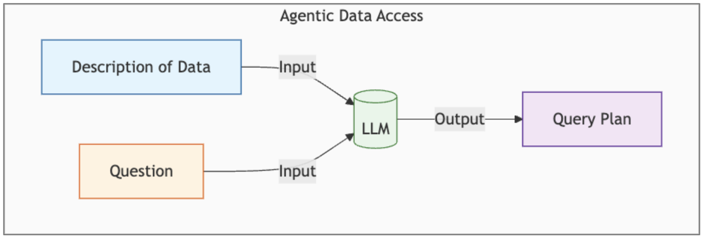
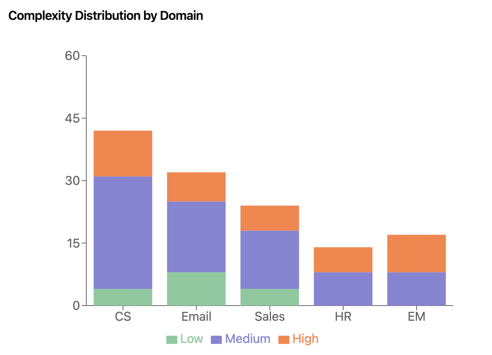
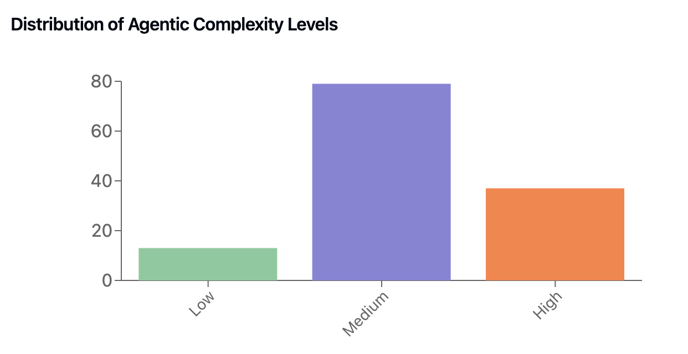
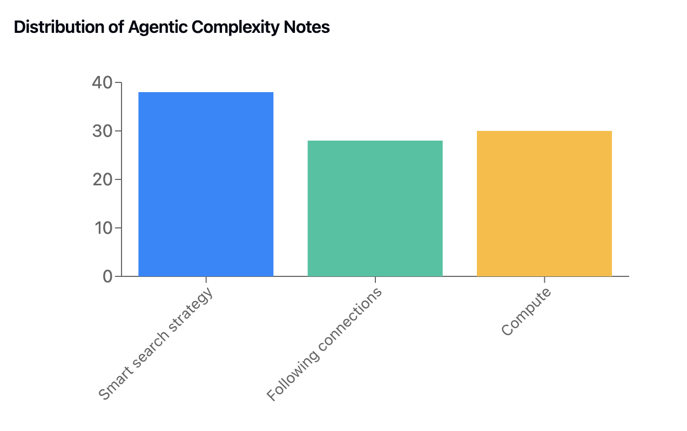
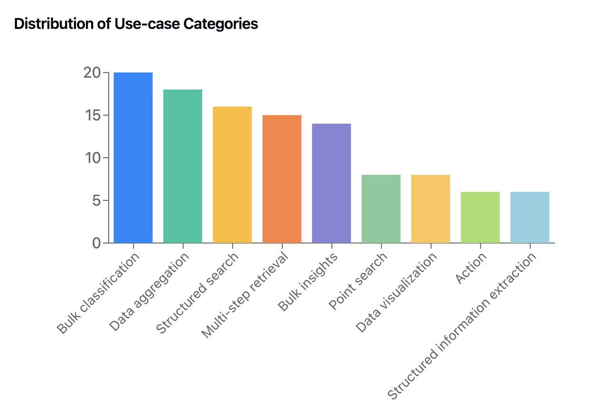
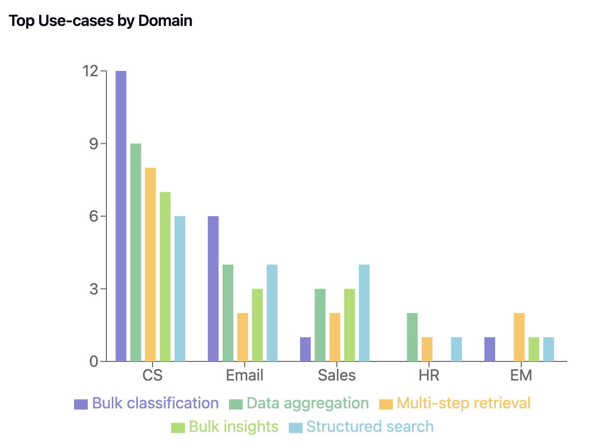

# Agentic Data Access and Computation benchmark (ADAC)

Agentic Data Access and Computation (ADAC) benchmark is a set of real-world questions over a few "closed domains" to illustrate the evaluation of AI assistants/agents in closed domains.
Closed domains are domains where data is not available implicitly in the LLM as they reside in secure or private systems e.g. enterprise databases, SaaS applications, etc,
and AI solutions require mechanisms to connect an LLM to such data. If you are evaluating an AI product or building your own AI architecture over closed domains, then you can use 
these questions/nature of questions to understand the capabilities of your system and qualitatively measure the performance of your assistants/agents.

ADAC benchmark was created because of severe shortcomings found in closed domain assistants in the wild. We found that apart from a few basic canned questions or workflows,
the assistants were struggling to do anything new. This was found to be because the assistant is not connected 
to sufficient data and is unable to perform complex or sequential operations over that data. We call the ability of an AI system, given the description of data, to agentically use and operate on that data as agentic data access.

## About the questions

The question set is hosted here: https://huggingface.co/datasets/hasura/agentic-data-access-benchmark

Preview:

| User goal | Domain | Agentic complexity level | Agentic complexity notes | Use-case category |
|--------|---------|---------------------|------------------|------------------|
| Show me unread emails from the past week which are important or need follow-up. | Email + Calendar | Medium | LLM compute | Bulk classification
| Get all receipts from food orders this month and tell me the net amount spent | Email + Calendar | High | LLM compute, Numeric compute | Bulk classification, Structured information extraction
| How many customers on paid plans have created support tickets in the last 7 days | Customer Support | High | Smart search strategy, Numeric Compute | Multi-step data retrieval, Data aggregation
| Which users are at risk of churn, look at project usage, support tickets, recent plan downgrades, etc? | Customer Support | Medium | Smart search strategy | Multi-step data retrieval, Bulk insights
| Go through all call transcripts with Acme opp and extract any MEDDPICC details | Sales | Medium | LLM compute | Structured information extraction
| Give a count of all bug fix related PRs that have been merged in the last month | Engineering Management | High | LLM compute, Numeric compute | Bulk classification, Data aggregation

We use a select set of common domains as a guiding "north star" to illustrate what an AI assistant/agent could be capable of achieving.
These domains are Customer Support, Email+Calendar, Sales, HR, Engineering Management and described in brief [here](./domains/domain-descriptions.md).

### Overall statistics

In total we have ~150 questions, the high level breakdown of the question on different dimensions is visualized below.

<table>
  <tr>
    <td></td>
    <td></td>
  </tr>
  <tr>
    <td></td>
    <td></td>
  </tr>
  <td></td>
  <td></td>
</table>

## Use-case categories

Below we describe fundamental use-case categories which are common across all domains: 

### Multi-step data retrieval

This use-case involves fetching data from multiple locations e.g. fetching data from different tables in a database, getting data from different databases, etc
It is possible that the data from one step is used in the next step (composition) as well.

*Example question (Customer Support):*  Get the projects, invoices, project usage for the user wile@acme.corp 

### Data aggregation

This use-case involves aggregating data from simpler data points e.g. counting, summing, grouping on list of items.
Note that for AI assistants, most of the aggregations would be for adhoc analysis where existing dashboards may not suffice or require non-trivial work. 

*Example question (HR):* What is the average hours count and dollar amount of PTO paid out to departing team members?

### Bulk insights

This use-case involves going to each data item and creating specific insights for each one of them

*Example question (Customer Support):* For all tickets open for more than a week, tell me what they are blocked on?

### Bulk classification

This use-case involves finding relevant items over bulk data by classifying/categorizing them as relevant or not.
Usually the classification is based on textual input rather than structured attributes.

*Example question (Email):* Get all receipts from food orders this month

### Clustering

This use-case involves finding similar properties in bulk data. 
This is different from bulk classification as the categories are not known beforehand.

*Example question (HR):* Extract any common pain points over all opportunities

### Point search

This use-case involves finding the most relevant item(s) with complex characteristics over bulk data.

*Example question (Email):* Find me the email from Wile where I spoke about business strategy

### Structured information extraction

This use-case involves extracting information from textual data in a structured format so it can be fed to other systems.

*Example question (Sales):*  Create a new opportunity for Acme corp from recent call transcripts, fill in Opportunity Name, Segment, Product SKU, ARR and Next Steps

### Data visualization

This use-case essentially involves visualizing or transforming data in a way where it is more easily consumable for a human.

*Example question (Email):* How have I spent my time on meetings this month?

## What's next

We are providing raw data for these domains in the `domains` folder (Note: we are starting with Customer Support first). 
You can evaluate the capabilities of your AI assistant by incorporating this data into your architecture and trying it with your LLMs.

We, at Hasura, have built PromptQL for agentic data access needs. Go to https://hasura.io/promptql to learn more. 
