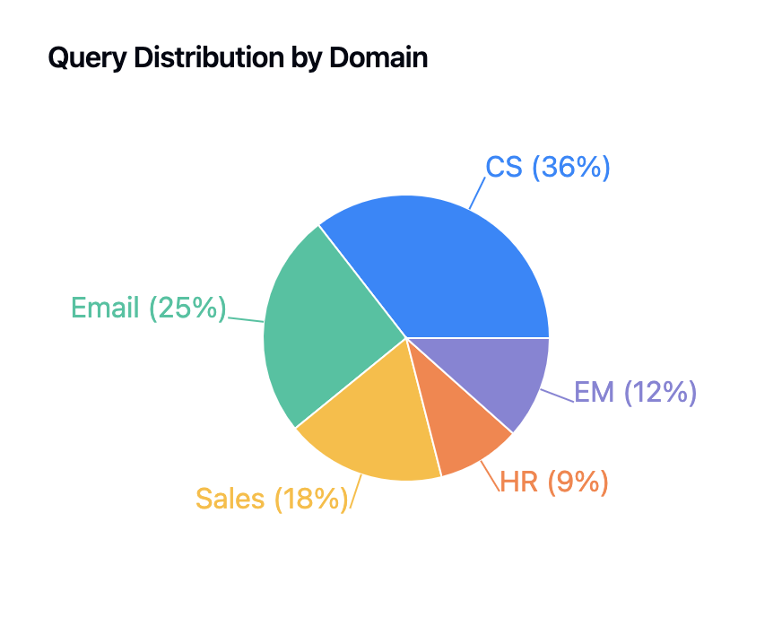
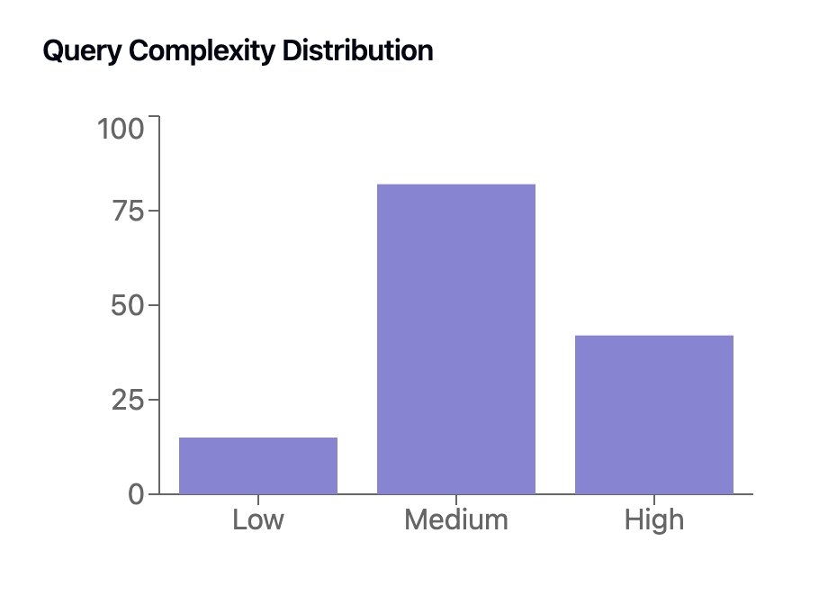
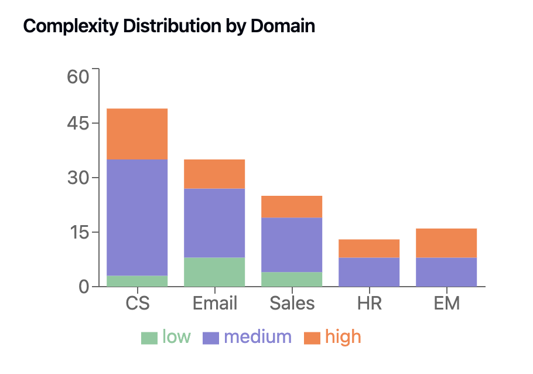
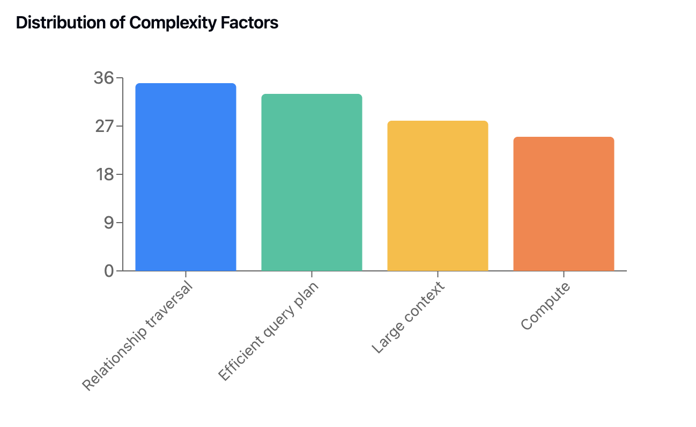
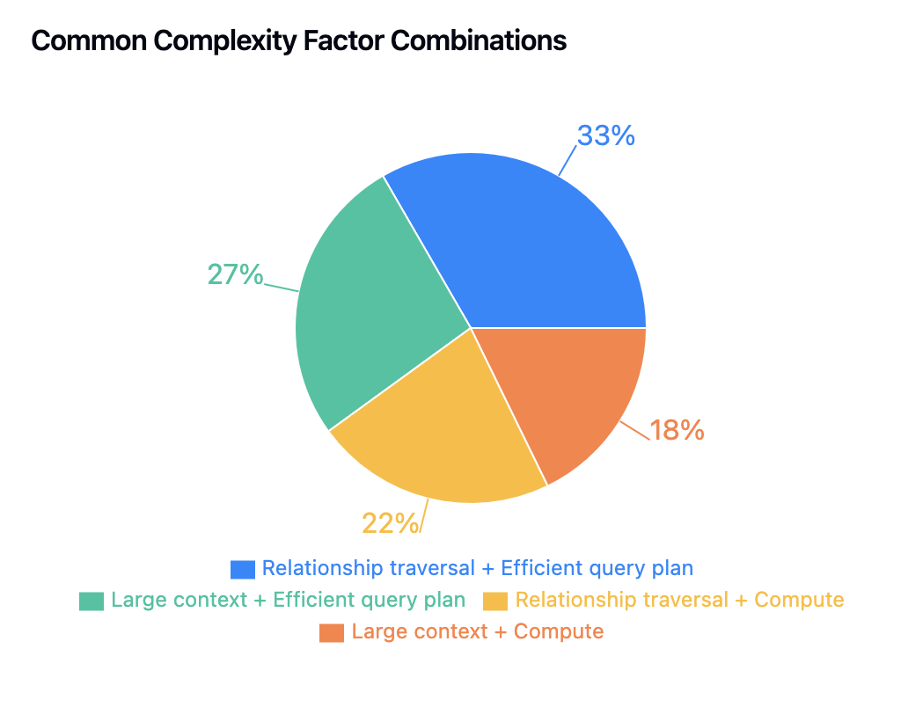

# Agentic Data Access benchmark (ADA benchmark)

Agentic Data Access benchmark is a set of real-world questions over few "closed domains" to illustrate the evaluation of closed domain AI assistants/agents.
Closed domains are domains where data is not available implicitly in the LLM as they reside in secure or private systems e.g. enterprise databases, SaaS applications, etc
and AI solutions require mechanisms to connect an LLM to such data. If you are evaluating an AI product or building your own AI architecture over closed domains, then you can use 
these questions/nature of questions to understand the capabilities of your system and qualitatively measure the performance of your assistants/agents.

ADA benchmark was created because of severe short-comings found in closed domain assistants in the wild. We found that apart from few basic canned questions or workflows,
the assistants were struggling to do anything new. This was found to be because the assistant is not connected 
to sufficient data and is unable to perform complex or sequential operations over that data. We call the ability of an AI system, given the description of data, to agentically use and operate on that data as agentic data access.

## About the questions

The question set is hosted here: https://huggingface.co/datasets/hasura/agentic-data-access-benchmark

Preview:

| Prompt | Domain | Data requirements | Data complexity level | Agentic complexity notes |
|--------|---------|-------------------|---------------------|------------------|
| Show me unread emails from the past week which are important or need follow-up. | Email + Calendar | 1. Get Emails in time range 2. Get Email Metadata | High | Following connections, Compute |
| Get all receipts from food orders this week | Email + Calendar | 1. Get Emails in time range 2. Get attachments | High | Following connections, Compute |
| Summarize my upcoming travel itinerary with flight numbers, hotels, car rentals, etc | Email + Calendar | 1. Get Emails | High | Smart search strategy, Compute |
| Are there any customers on paid plan who have created support tickets in the last 7 days | Customer Support | 1. Get Tickets of last 7 days with the `email` of the submitter 2. Get Users for those emails 3. Get Projects with Plans for those users | Medium | Following connections |
| Are there any support tickets that have not been responded to in the last 30 days | Customer Support | 1. Get Tickets and Ticket Comments of last 30 days | Medium | Large context/Smart search strategy |
| Which users are at risk of churn, look at project usage, support tickets, etc? | Customer Support | 1. Get Tickets from ~90 days ago 2. Get Projects where Usage is low or zero 3. Get Projects where Errors are high | High | Large context, Following connections, Compute |
| Help me prioritize support ticket #1234 amongst other open tickets based on user's plan, revenue and usage | Customer Support | 1. Get all Tickets with `status=open` 2. Get Project from project_name or submitter email 3. Get Plan from Project 4. Get Invoices from project 5. Get Usage from Project | High | Smart search strategy, Following connections |

We use a select set of common domains as a guiding "north star" to illustrate the what an AI assistant/agent could be capable of achieving.
These domains are Customer Support, Email+Calendar, Sales, HR, Engineering Management and described in brief [here](./domain-descriptions.md).

### Overall statistics

In total we have 138 questions, the high level breakdown of the question on different dimensions is visualized below.

<table>
  <tr>
    <td></td>
    <td></td>
  </tr>
  <tr>
    <td></td>
    <td></td>
  </tr>
  <td></td>
</table>

## Primitive functionalities

TODO

## Analyzing sample questions

Let's look at few sample questions and analyze qualitatively what it would take to make it work effectively.

**Q1:** (CS domain) *Are there any customers on paid plans who have created support tickets in the last 7 days*

This question requires fetching support tickets in the last 7 days, getting the id or email or project of the ticket submitter, geting their corresponding projects, checking if the plan is paid for those projects. There are various complexities in performing the aforementioned procedure, for instance, the number of support tickets could be quite high (few thousands for a large company) causing large context problems, extracting identifying information from a ticket can be tricky because it could have been created through different channels (direct ticketing, email, phone number, etc) with different kind ofidentifying information. Getting corresponding projects can have absolutely no mistakes - because it is business critical. Lastly, there could be multiple SKUs for a "paid" plan.

**Q2:** (Email domain) *Summarize my upcoming business travel itinerary with flight numbers, hotels, car rentals, etc*

This question requires searching through recent emails to look for travel related bookings. It also may be required to extract necessary information from attachments in those emails.
There are various complexities in performing this task well: we do not know how many emails in the past to look at, there may be more than one business travel in the future hence grouping related business travel together is very important, information should be extracted from attachements and most importantly, there should not be any wrong information (missing information is still fine).

**Q3:** (Sales domain) *Look at recent activities on Acme Corp opportunity and list follow-up tasks from the activity notes*

This question requires finding the right opportunity, looking at the detailed summary/notes in the activities for that opportunity or fetching the corresponding call transcripts/email threads. The main complexity here is understanding implicit relationships in data i.e. activity -> email/call transcript and traversing such implicit relationships effectively.

**Q4:** (HR domain) *What is the average hours count and dollar amount of PTO paid out to departing team members last year?*

This question requires performing a complex calculation over a highly interconnected data model. This is a business critical query and hence there can be no mistakes. For example, it must be ensured that team members used in the calculations are exactly the ones leaving last year, currency should be converted appropriately, ideally actual pay documents with PTO payment should be extracted as well for references.

**Q5:** (Engineering domain) *Suggest a reviewer for PR 1234 by seeing who has contributed the most to the files that have changed in the PR and previous commiters*

To give a good answer here requires making a few intelligent decisions e.g. look for recent contributors instead of lifetime contributors, suggest reviewers who are currently in the org (and not departed employees), look for contributors in the specific team of the PR creator, etc. 

## What's next

TODO
